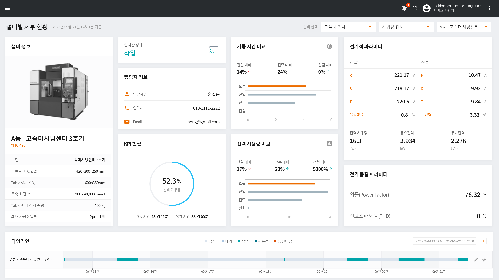
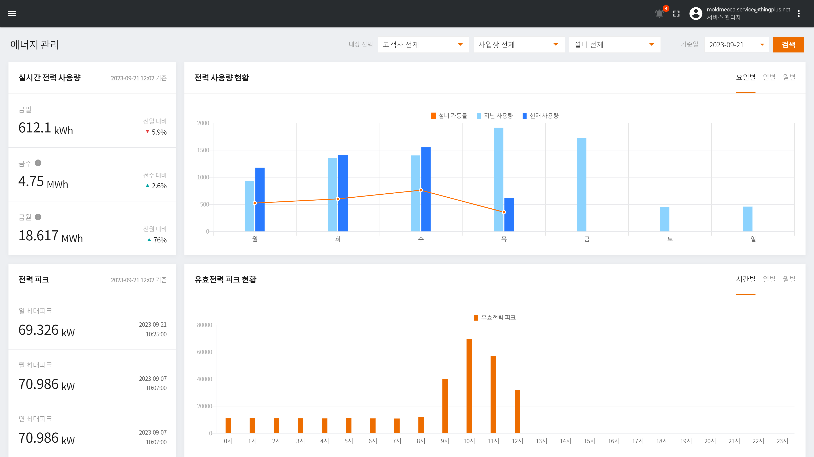
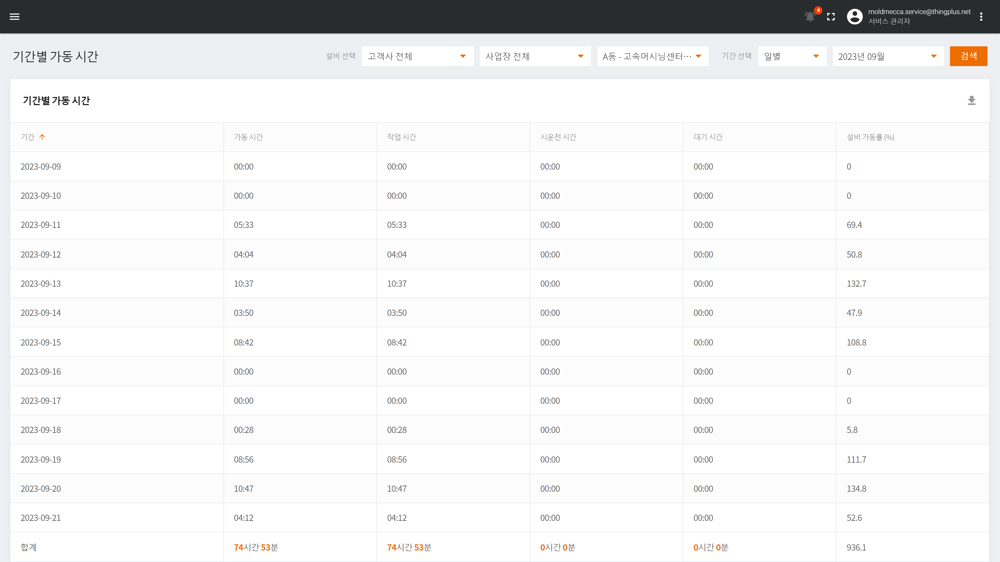
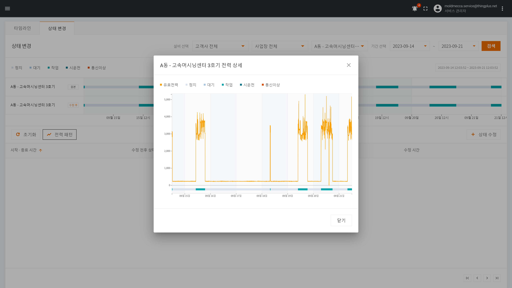

<h1 align="center">Welcome to DWAIoTDeviceMonitoring 👋</h1>

  

> This project is for device monitoring

## Author

👤 **Daliworks**

## Preview

👉Total Management

  

---

👉Energy Management

  

---

👉Report Management

  

---

👉Status Management

  

## Show your support

Give a ⭐️ if this project helped you!

---

_This README was generated with ❤️ by [readme-md-generator](https://github.com/kefranabg/readme-md-generator)_
